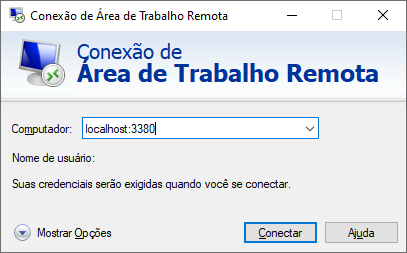

# akerclient-x11
VPN Aker Client with X11


# RUN 
1. Execute one X11 server. I suggest https://mobaxterm.mobatek.net/ for simple and good UI;

2. Set environment VPNRDPIP to Remote Desktop IP Address (RDP Server) in docker-compose.yml

3. Run container akerclient and wait window Aker Client to display
```shell
#run with docker-compose and listening port 3380 
docker-compose run --rm --service-ports akerclient
```
```shell
#OR run with docker
docker run -it --rm -v /tmp/.X11-unix:/tmp/.X11-unix -v /lib/modules:/lib/modules:ro -v home:/root  -e DISPLAY=host.docker.internal:0.0 -e VPNRDPIP=<remote_desktop_ip_here> --name akerclient --shm-size 2g --privileged humbertosales/akerclient-x11
```
4. Execute Aker CLI in bash opened. If not display, run again. 
```
	/usr/local/AkerClient/akerclient_init.sh
```

5. Setting server and export configuration to /root (volume monted to ./home) for next times.

6. Connect Microsoft Terminal Service (Remote Access) in *localhost:3380*




# Tested 

 * Docker Desktop (windows) version 2.2.0.5 (build 43884) - stable (Linuxkit Kernel 4.19.76) - TAG 2.2.0.5
 * Docker Desktop (windows) version 2.3.0.2 (build 45183) - stable (Linuxkit Kernel 4.19.76) - TAG 2.3.0.2
 
 